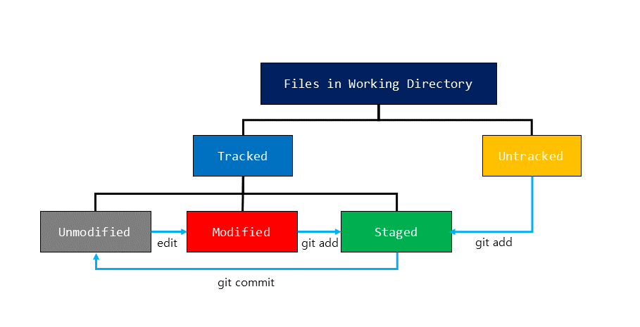

# Git
## Initial Settings

- Username and email
``` 
git config --global user.name "Young"
git config --global user.email young@example.com
```

- Default editor 
```
git config --global core.editor vim
```

- List all the settings
```
git config --list
```
## Basics
- `git clone` : Clone a repository into a new directory
```
$ git clone <repository> [<directory>]
```
- `git init` : Create an empty Git repository or reinitialize an existing one
```
$ git init
```
- `git add` : Add file contents to the <a href=https://git-scm.com/about/staging-area>index</a>
```
$ git add <filename>
```
- `git commit` : Record changes to the repository
```
$ git commit -m <message>
```

## Check
- `git status` : Show the working tree status
```sh
$ git status [-s or --short]
On branch master
Your branch is up to date with 'origin/master'.

Changes to be committed:
  (use "git restore --staged <file>..." to unstage)
        new file:   img/img1.png

Changes not staged for commit:
  (use "git add/rm <file>..." to update what will be committed)
  (use "git restore <file>..." to discard changes in working directory)
        modified:   git.md
        deleted:    src/img1.png
```
<center>

</center>

- `git diff` : Show changes between commits, commit and working tree, etc

- `git log` : Show commit logs
```
$ git log
commit bc405e691a71395ddeb65052feafea60a4fa5897 (HEAD -> master, origin/master)
Author: Young <young@example.com>
Date:   Wed Oct 24 12:46:00 2018 +0900

    Add image file

commit 44554290c71b73e4e4c4f5f2356927a5c7b5aa66
Author: Young <young@example.com>
Date:   Wed Oct 24 11:32:03 2018 +0900

    Add git folder
```

## .gitignore file
- tbc

## Reference
- <a href=https://git-scm.com> Git Official Website </a>
- <a href=https://try.github.io/>Resources to learn Git </a>

## Useful Websites
- <a href=https://learngitbranching.js.org/> Learn Git Branching </a>
- <a href=https://github.com/github/gitignore/> .gitignore examples </a>